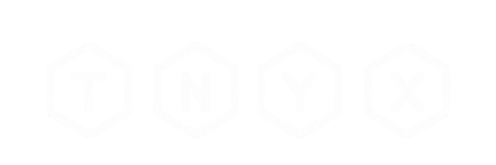

# Tnyx

<p align="center">
  
</p>

<p align="center">
  A local-first, encrypted password manager for the desktop.
</p>

<p align="center">
  <strong>Simple to use. Encrypted at rest. Designed with secret handling in mind.</strong>
</p>

---

## Overview

**Tnyx** is a desktop password manager built in Java with a deliberately local-first approach.

Your vault is stored as an encrypted `.tvlt` file on your own machine. There is no account to create, no cloud vault to depend on, and no server required for the core application. Tnyx provides a graphical desktop interface for creating and managing password entries while keeping the vault locked behind a master password.

The project started as a small password-vault experiment and grew into a complete desktop application, with particular attention given to the details that are easy to overlook in password-management software: authenticated encryption, key lifetime, file integrity, safe saving, clipboard handling, inactivity locking, malformed-input handling, and build reproducibility.

> **Security note:** Tnyx is a personal/open-source project and has not undergone an independent security audit. It should not be treated as a professionally audited password manager. The security design and hardening work are documented in [`tnyx/SECURITY_HARDENING_CHECKLIST.md`](tnyx/SECURITY_HARDENING_CHECKLIST.md).

## Features

### Vault management

- Create new encrypted vaults
- Open existing `.tvlt` vaults
- Add, edit, and delete password entries
- Store:
  - Name
  - Username
  - Password
  - URL
- Automatic persistence after entry changes
- Explicit handling of unsaved changes when locking or exiting
- Cooperative per-vault file locking to prevent simultaneous edits from multiple Tnyx processes
- Detection of external vault modifications before saving

### Password handling

- Passwords are held as `char[]` rather than ordinary Java `String` values where practical
- Password fields are cleared after use
- Existing passwords are not pre-filled into edit dialogs
- Passwords are only revealed in the entry view while temporarily focused
- Passwords can be copied to the system clipboard
- Tnyx clears its own clipboard contents after 30 seconds
- Clipboard clearing is also performed when the application locks or exits

### Automatic locking

Tnyx automatically locks the open vault after **5 minutes of inactivity**.

The inactivity timer uses monotonic time rather than wall-clock time. When locking, Tnyx handles pending changes explicitly:

- Manual lock/exit: choose **Save**, **Discard**, or **Cancel**
- Automatic lock: attempts to save pending changes and then locks the vault

### Encryption

Tnyx uses a two-level key design:

1. The master password is processed with **Argon2id** to derive a key-encryption key (KEK).
2. A randomly generated **256-bit data-encryption key (DEK)** encrypts the vault contents.
3. The DEK is itself encrypted with the KEK.
4. Vault data and the wrapped DEK are protected with **AES-256-GCM**.

The current fixed Argon2id profile is:

| Parameter | Value |
|---|---:|
| Memory | 65,536 KiB (64 MiB) |
| Iterations | 3 |
| Parallelism | 1 |
| Output | 256 bits |
| Salt | 16 bytes |
| AES-GCM nonce | 12 bytes |
| AES-GCM authentication tag | 128 bits |

The vault format does not allow the vault file itself to choose arbitrary Argon2 work factors.

### File integrity and safe saving

Tnyx takes several precautions around vault files:

- Vault reads are size-bounded.
- Vault paths are checked against symlink-based access.
- Saves are written through a temporary file and replaced atomically.
- New-vault creation refuses to overwrite an existing file.
- A SHA-256 fingerprint is recorded when a vault is opened and checked before saving.
- If the vault changed externally while it was open, Tnyx refuses to overwrite those changes.
- A cooperative sidecar file lock prevents two Tnyx processes from editing the same vault simultaneously.
- Encrypted vault parsing rejects unsupported parameters, malformed lengths, truncation, and trailing data.

### Vault format

The current plaintext payload format is **v4**. Older plaintext **v3** vault payloads can be read as a migration input, while new saves emit v4.

The outer encrypted container currently uses format **v3**.

Tnyx also validates entry counts, entry sizes, field sizes, UTF-8/UTF-16 encoding, and duplicate entry UUIDs before accepting vault data.

### Build and supply-chain hardening

The build includes several reproducibility and dependency-safety measures:

- Java 21 bytecode target
- Explicitly pinned Maven plugin versions
- Maven Enforcer checks
- Dependency convergence enforcement
- CycloneDX SBOM generation
- Optional OWASP Dependency-Check security scanning
- Optional GPG release signing
- Fixed build output timestamp for reproducible artifacts

---

## Screenshots

The application is designed around a small number of focused screens:
- **Lock screen** — choose a vault, enter the master password, create a new vault, or exit.
-
- **Vault view** — browse entries in a scrollable list.


---

## Getting Started

### Requirements

For building from source:

- **Java 21–26**
- **Maven 3.9.16 or newer**

Java 21 is the project's compilation target. Newer JDKs in the supported range may also be used to build the project.

### Running the application

Tnyx is a desktop application. When launched normally, it opens the graphical interface.

If you have a packaged build available, use that build rather than building from source.

On Linux, the repository may include a `Tnyx.AppImage` release artifact. Make it executable and launch it:

```bash
chmod +x Tnyx.AppImage
./Tnyx.AppImage
```

### Building from source

Clone the repository and enter the Maven project:

```bash
git clone https://github.com/Schimmeltoast08/Tnyx.git
cd Tnyx/tnyx
```

Build and validate the project:

```bash
mvn clean verify
```

The packaged build is produced during the Maven lifecycle, and the `package` phase also generates a CycloneDX software bill of materials (SBOM).

To run the security dependency scan:

```bash
mvn clean verify -Psecurity-scan
```

The security profile uses OWASP Dependency-Check and is configured to fail the build for vulnerabilities at **CVSS 7 or higher**.

For additional build and release information, see [`tnyx/BUILD.md`](tnyx/BUILD.md).

---

## Using Tnyx

### 1. Create a vault

Start Tnyx and choose a destination file.

Enter a strong master password and select **New**.

The vault is created as a `.tvlt` file. Tnyx will not silently overwrite an existing vault when creating a new one.

### 2. Open a vault

Select an existing `.tvlt` file and enter its master password.

If authentication succeeds, the vault contents are loaded into the desktop interface.

### 3. Add an entry

Select **Add** and enter:

- Name
- Username
- URL
- Password

The password field starts empty. This is intentional: Tnyx does not copy an existing password into an edit field merely because an entry is being edited.

### 4. Reveal or copy a password

Select an entry.

The password can be temporarily revealed by focusing its password field, or copied using **Copy**.

Revealed passwords are hidden again when the field loses focus.

Copied passwords are automatically cleared from the clipboard after 30 seconds, and Tnyx also clears its own clipboard value when locking or exiting.

### 5. Edit or delete an entry

Select an entry and choose **Edit** or **Delete**.

Changes are persisted to the vault. Deletions require confirmation.

### 6. Lock the vault

Use **Return to Lockscreen** to close the active vault session without exiting the application.

After five minutes without activity, Tnyx automatically locks the vault.

---

## Security Model

Tnyx is built around the idea that the encrypted vault file should not contain usable plaintext secrets.

At a high level:

```text
                    Master Password
                           │
                           ▼
                       Argon2id
                           │
                           ▼
                    256-bit KEK
                           │
                           │ unwraps
                           ▼
                    256-bit DEK
                           │
                           │ encrypts
                           ▼
                  Vault plaintext data
                           │
                           ▼
                      AES-256-GCM
                           │
                           ▼
                     Encrypted .tvlt
```

Each vault has its own random salt.

Each save generates fresh encryption nonces, including a fresh nonce for wrapping the DEK. This avoids reusing the same AES-GCM nonce/ciphertext pair when a vault is saved repeatedly.

The encrypted vault also authenticates its ciphertext. Tampering with encrypted data should therefore result in authentication failure rather than silently producing modified plaintext.

### Secret lifetime

The implementation makes an effort to limit the lifetime and duplication of sensitive material in memory:

- KEK and DEK material is owned by the vault session.
- Closing the session destroys its key material and prevents further cryptographic operations through that session.
- Temporary password/key byte arrays are cleared where practical.
- Password entry data uses `char[]` at the model/API boundaries.
- GUI password fields are cleared rather than being kept populated indefinitely.

These measures reduce unnecessary exposure; they cannot make secrets impossible to recover from a compromised operating system or machine.

### What Tnyx cannot protect against

No application-level password manager can completely eliminate risks from a compromised host.

For example, Java code cannot guarantee protection against:

- A malicious operating system or administrator
- Memory scraping by a sufficiently privileged attacker
- Swap/hibernation images containing sensitive memory
- System-wide keyloggers
- Compromised hardware
- Malicious accessibility/input software
- Crash dumps captured while secrets are in memory

For sensitive environments, use full-disk encryption and appropriate operating-system security controls in addition to Tnyx.

---

## Vault File Limits

Tnyx intentionally applies bounds to data it reads and writes.

| Limit | Value |
|---|---:|
| Maximum plaintext vault size | 64 MiB |
| Maximum entries | 10,000 |
| Maximum entry name | 16 KiB |
| Maximum username | 16 KiB |
| Maximum password | 64 KiB |
| Maximum URL | 16 KiB |
| Maximum master-password UTF-8 size | 1 MiB |

These limits are primarily defensive: they keep malformed or hostile vault data from requesting unbounded allocations.

---

## Project Structure

```text
Tnyx/
├── Tnyx.AppImage
├── tnyx/
│   ├── pom.xml
│   ├── BUILD.md
│   ├── VALIDATION.md
│   ├── SECURITY.md
│   ├── SECURITY_HARDENING_CHECKLIST.md
│   ├── .github/
│   │   └── workflows/
│   │       └── ci.yml
│   └── src/
│       ├── main/
│       │   ├── java/
│       │   │   └── com/tnyx/
│       │   │       ├── crypto/
│       │   │       ├── ui/
│       │   │       ├── util/
│       │   │       ├── vault/
│       │   │       └── Main.java
│       │   └── resources/
│       │       ├── Tnyx-logo.png
│       │       └── Tnyx-logo-no-background.png
│       └── test/
│           └── java/
│               └── com/tnyx/
└── .gitignore
```

### Main components

**`crypto/`**

Contains key derivation, AES-GCM operations, encrypted-vault state, session lifetime management, and cryptographic constants.

**`vault/`**

Contains the vault model, password entries, serialization, encrypted container serialization, file locking, safe file I/O, and vault lifecycle operations.

**`ui/`**

Contains the Swing desktop interface, lock screen, vault entry panels, entry dialogs, theme handling, clipboard management, and inactivity locking.

**`test/`**

Contains unit tests covering the vault model, serialization, password entries, and encryption behavior.

---

## Testing and Validation

The project contains tests for:

- Password entry behavior
- Password entry serialization
- Vault behavior
- Vault serialization
- Encryption behavior

The hardening work has additionally been validated against cases including:

- AES-GCM encryption/decryption round trips
- Wrong master-password authentication failure
- Independent salts/nonces between vaults
- Session-close revocation
- Fresh save nonces and DEK rewrapping
- Legacy v3 migration parsing
- Refusal to overwrite an existing vault
- Concurrent-open locking
- External modification detection
- Encrypted ciphertext tampering
- Truncation and trailing-data rejection
- Entry-count and entry-size limits
- Duplicate UUID rejection
- Malformed UTF-8 rejection

See [`tnyx/VALIDATION.md`](tnyx/VALIDATION.md) for the project's validation record and its stated limitations.

The CI workflow runs the normal Maven verification and the dependency security scan on Ubuntu using Java 21.

---

## Security Reporting

If you discover a potential vulnerability affecting vault confidentiality or integrity, please **do not disclose it in a public issue first**.

See [`tnyx/SECURITY.md`](tnyx/SECURITY.md) for the information to include in a security report.

Never include real master passwords, real vault files, recovery codes, or production credentials in a report.

---

## Development

The project intentionally keeps the build configuration explicit.

To perform a normal development validation:

```bash
cd tnyx
mvn clean verify
```

For dependency security scanning:

```bash
mvn clean verify -Psecurity-scan
```

For release signing, configure a trusted GPG signing key in your environment and use:

```bash
mvn clean verify -Prelease-signing
```

Private keys, passphrases, real vaults, and generated secret material should never be committed to the repository.

See [`tnyx/BUILD.md`](tnyx/BUILD.md) for the complete build notes.

---

## Design Goals

Tnyx is intentionally modest in scope.

It focuses on doing a small set of things locally:

- Keep passwords inside an encrypted vault.
- Provide a straightforward desktop interface.
- Avoid requiring an online account or cloud service for normal use.
- Minimize unnecessary exposure of secrets in memory and the GUI.
- Treat vault files as untrusted input.
- Refuse to overwrite changes made outside the application.
- Make security-related behavior explicit in the source instead of hiding it behind claims.

The result is a password manager that is intentionally understandable: the encrypted file format, cryptographic parameters, vault lifecycle, and hardening measures are all present in the source tree.

---

## Current Status

Tnyx is an actively developed personal/open-source project.

The application currently has a functional desktop GUI for creating, opening, locking, and managing encrypted password vaults, together with a hardened vault and cryptographic backend and automated CI validation.

The project is still evolving. In particular, security-sensitive software benefits from continued review, testing, platform-specific validation, and eventually independent security auditing.

---

## Contributing

Contributions, bug reports, security feedback, and code review are welcome.

When contributing:

1. Keep security-sensitive changes explicit and reviewable.
2. Add or update tests for behavioral changes.
3. Do not commit generated `target/` output.
4. Never commit real `.tvlt` vaults or credentials.
5. Preserve the project's defensive parsing and file-integrity checks.
6. Run the relevant Maven validation before opening a pull request.

For security vulnerabilities, follow [`tnyx/SECURITY.md`](tnyx/SECURITY.md) instead of opening a public issue.

---

## License

No license file is currently included in the repository.

If you intend Tnyx to be used, modified, or redistributed by others, add an explicit open-source license (or other licensing terms) to the repository before treating the project as licensed for external use.

---

<p align="center">
  <sub>Built with Java, Swing, Bouncy Castle, and a lot of attention to the uncomfortable details.</sub>
</p>
